# Deploying an application in Kubernetes 

## Escenarios
Usamos microk8s para usar kubernetes de manera local. Se instala mediante un paquete snap

```
sudo snap install microk8s --classic
```

Ese commando instala microk8s y lo inicializa con 1 nodo.
Al instalar el microk8s debemos crear un grupo con el mismo nombre y asignar nuestro usuario a ese grupo

```
sudo usermod -a -G microk8s $USER
sudo chown -f -R $USER ~/.kube
```

Esta es la configuracion basica que necesitamos para usar microk8s

```
sudo snap alias microk8s.kubectl kubectl
```
Ese comando nos permite usar 'kubectl' como alias para microk8s.kubectl

Como necesitamos mas maquinas para poder agregarlas al cluster, usaremos `multipass` que nos permite crear vm de ubuntu de manera rapida.
Creamos 3 vm de ubuntu, 2 para que sean workers de nuestro cluster y una 3era vm para que sera nuestro master

```
multipass launch -m 4Gb -n <vm-name>
multipass shell <vm-name>
```
En cada uno de estos nodos hay que instalar el microk8s con snap y configurarlos para tener acceso
Para agregar un nodo se ejecuta el comando:

```
kubectl add-node 
```

El cual nos devuelve un comando que debemos ejecutar en el otro nodo que queremos agregar como worker
```
microk8s join 10.41.162.1:25000/ea4ef488f5526e73e5ea00afe84177c0/0d7c0b9d696a
```

Ejecutamos en 2 de nuestros vm de ubuntu y agregamos a nuestro cluster

Los resultados de `kubectl cluster-info` y `kubectl get nodes -owide` para los 2 clusters son:

*single-node*

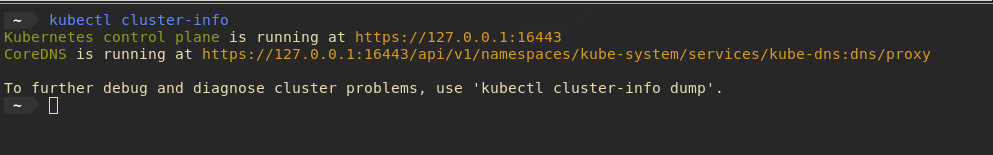
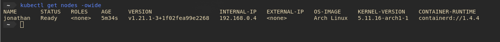
*multi-node*

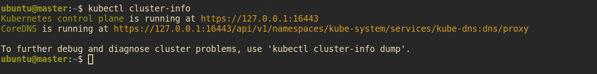
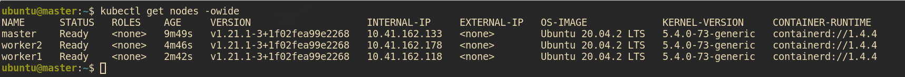

## Aplicación
**GuestBook con MongoDB**

### Objetivo:
* Guestbook es una aplicación multi-tier que gestiona las visitas realizadas a través de una interfaz sencilla.
* MongoDB es un *document-oriented database* NoSQL

### Arquitectura:


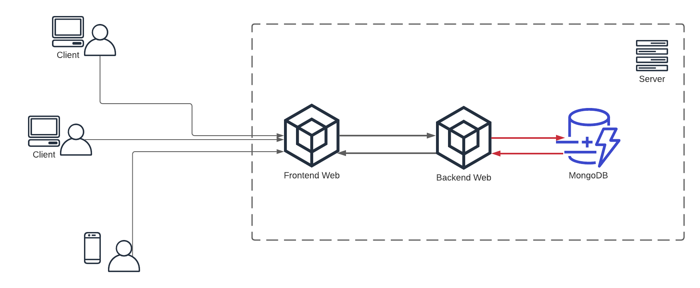

### Funcionalidad:

* Guestbook es una aplicación web que se encarga de registrar las visitas al sitio a través de un formulario sencillo.
* Se encuentra desarrollador en los lenguajes de programación JavaScript, PHP y usa MongoDB como capa de persistencia.

## Deployment

Primero creamos el Mongo Deployment

```yaml
apiVersion: apps/v1
kind: Deployment
metadata:
  name: mongo
  labels:
    app.kubernetes.io/name: mongo
    app.kubernetes.io/component: backend
spec:
  selector:
    matchLabels:
      app.kubernetes.io/name: mongo
      app.kubernetes.io/component: backend
  replicas: 1
  template:
    metadata:
      labels:
        app.kubernetes.io/name: mongo
        app.kubernetes.io/component: backend
    spec:
      containers:
      - name: mongo
        image: mongo:4.2
        args:
          - --bind_ip
          - 0.0.0.0
        resources:
          requests:
            cpu: 100m
            memory: 100Mi
        ports:
        - containerPort: 27017
```
Despues debemos crear el MongoDB Service

```yaml
apiVersion: v1
kind: Service
metadata:
  name: mongo
  labels:
    app.kubernetes.io/name: mongo
    app.kubernetes.io/component: backend
spec:
  ports:
  - port: 27017
    targetPort: 27017
  selector:
    app.kubernetes.io/name: mongo
    app.kubernetes.io/component: backend
```

La siguiente parte es crear nuestro GuestBook Frontend y eso cuenta con el Deployment y el servicio

El deployment se genera con el siguiente archivo yaml

```yaml
apiVersion: apps/v1
kind: Deployment
metadata:
  name: frontend
  labels:
    app.kubernetes.io/name: guestbook
    app.kubernetes.io/component: frontend
spec:
  selector:
    matchLabels:
      app.kubernetes.io/name: guestbook
      app.kubernetes.io/component: frontend
  replicas: 3
  template:
    metadata:
      labels:
        app.kubernetes.io/name: guestbook
        app.kubernetes.io/component: frontend
    spec:
      containers:
      - name: guestbook
        image: paulczar/gb-frontend:v5
        # image: gcr.io/google-samples/gb-frontend:v4
        resources:
          requests:
            cpu: 100m
            memory: 100Mi
        env:
        - name: GET_HOSTS_FROM
          value: dns
        ports:
        - containerPort: 80
```

y el Servicio se genera con:

```yaml
apiVersion: v1
kind: Service
metadata:
  name: frontend
  labels:
    app.kubernetes.io/name: guestbook
    app.kubernetes.io/component: frontend
spec:
  ports:
  - port: 80
  selector:
    app.kubernetes.io/name: guestbook
    app.kubernetes.io/component: frontend

```

Todos los archivos yaml deben estar dentro de una carpeta en la cual ejecutaremos cada uno de los archivos yaml y se
generaran los deployments y servicios para cada uno

```
kubectl apply -f ./
```
Para poder ver nuestro frontend en el browser utilizaremos port-forward para poder conectar el puerto 8080 con nuestro puero 80
y ver el guestbook desde ese puerto en localhost

```
kubectl port-forward svc/frontend 8080:80
```
Finalmente mostramos capturas del frontend; cualquier mensaje que se envie por el submit sera enviado al mongodb y aparecera
en nuestra pantalla
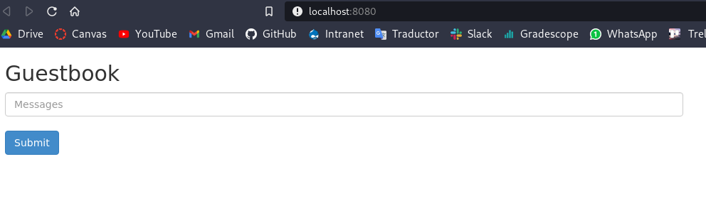
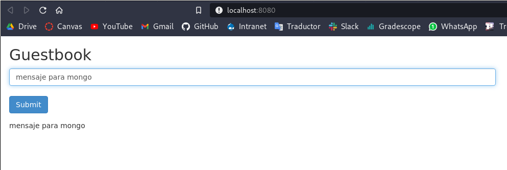
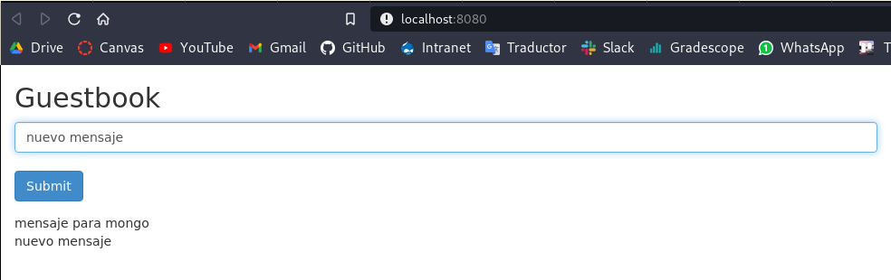


Al hacer el deployment de esta aplicación en nuestro cluster con un solo nodo, podemos ver que todos los pods estan asignados
a un solo nodo

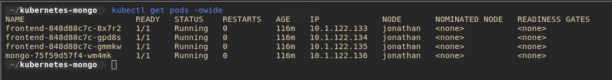

Por otro lado, en el caso de hacer el deployment en nuestro cluster con varios nodos, podemos ver como cada pod esta distribuido entre
nuestros nodos workers

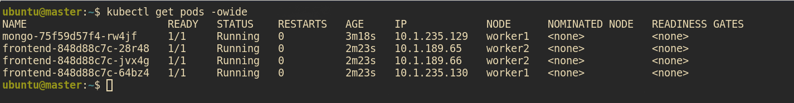


## Flujo de la Aplicación

Flujo Alto Nivel

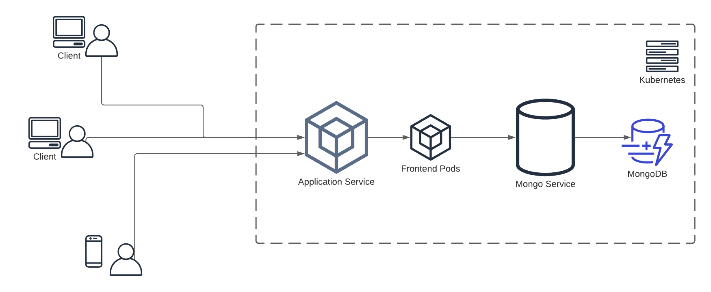

Flujo Bajo Nivel

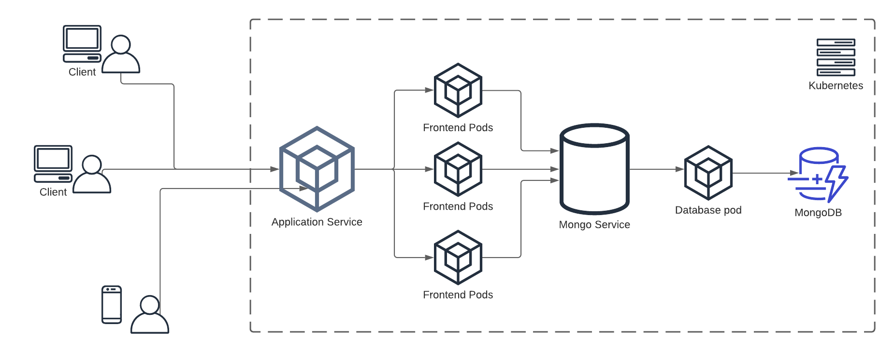

